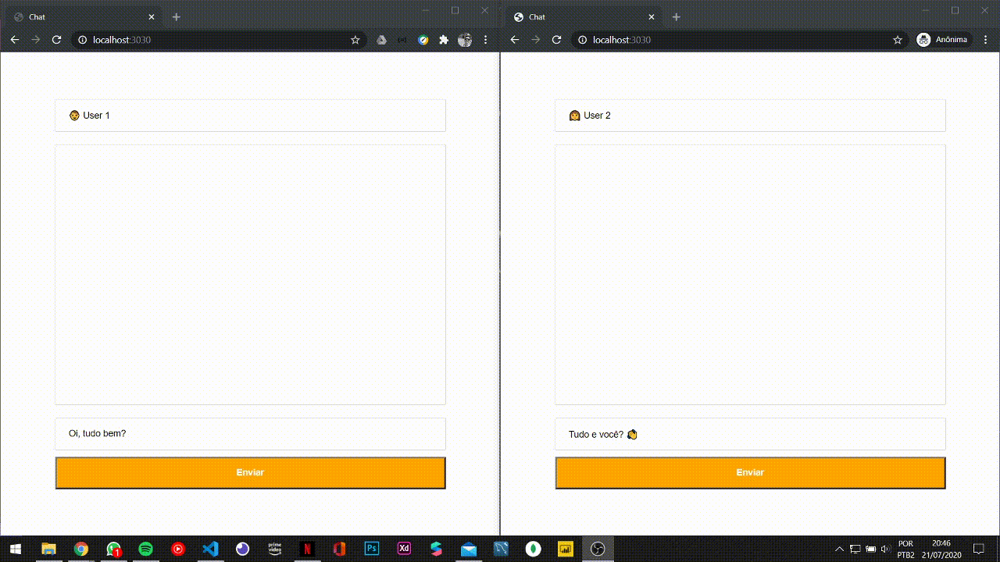

# Socket.io Example

Simple socket.io example using nodeJs

<p align="center">
  

  </p>

## Installation

Clone this repository and run

```bash
node server.js
```

## Contributing

Pull requests are welcome. For major changes, please open an issue first to discuss what you would like to change.

Please make sure to update tests as appropriate.

## License

[MIT](https://choosealicense.com/licenses/mit/)
